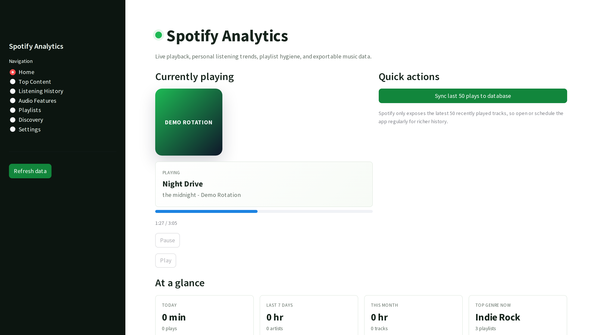
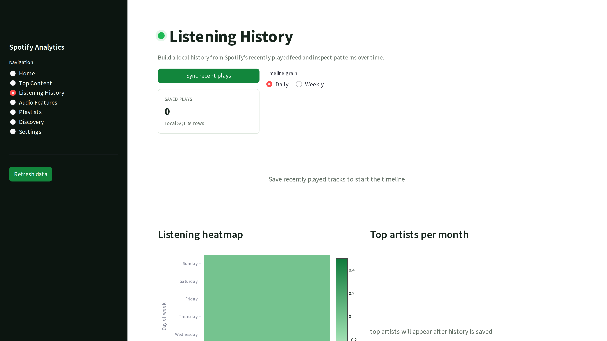
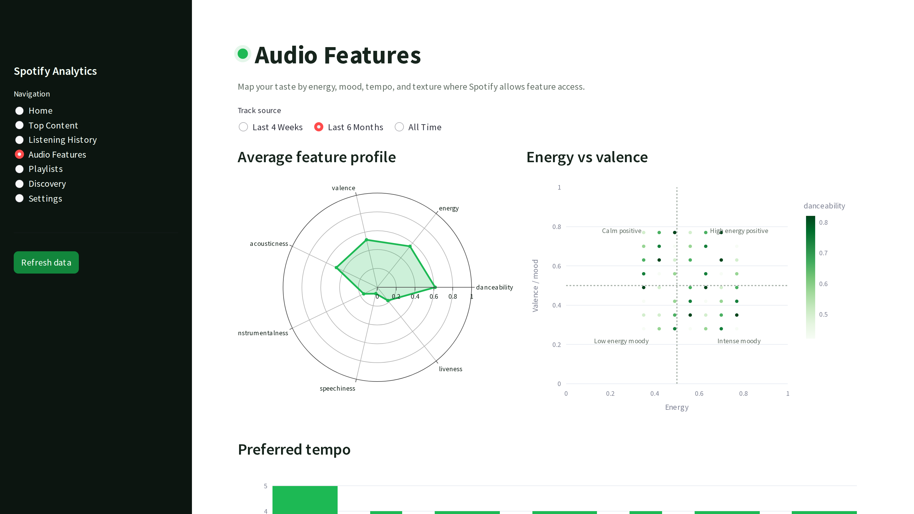
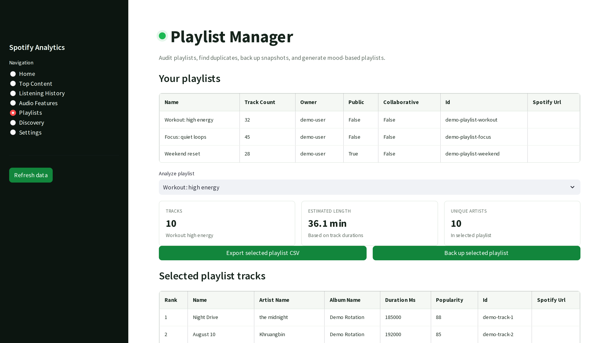

# Spotify Analytics Dashboard


A professional Streamlit dashboard for personal Spotify analytics. The app authenticates with Spotify, shows live playback, analyzes top tracks and artists, stores recently played history in SQLite, audits playlists, and exports listening data for deeper analysis.

This project demonstrates OAuth API integration, local data persistence, data visualization, and product-minded dashboard design.

Finding: In May 2026, my saved Spotify history showed a repeat-listening pattern: the leading artist had 8 plays, and the top repeated track appeared 4 times, turning the raw API feed into a repeat-listening pattern.



## Demo

The app is designed for local OAuth because Spotify redirects to a loopback callback during authentication.

- Walkthrough video: [assets/demo/demo.mp4](assets/demo/demo.mp4)
- Screenshot set: [assets/demo](assets/demo)
- Validation notes: [docs/PORTFOLIO_PROOF.md](docs/PORTFOLIO_PROOF.md)

[](assets/demo/demo.mp4)

## Screenshots







## Features

- Spotify OAuth with token caching through Spotipy.
- Current playback card with album art, track metadata, progress, and playback actions.
- Top tracks and artists for short, medium, and long Spotify time windows.
- Local listening history saved to SQLite from Spotify's recently played endpoint.
- Timeline, listening heatmap, monthly artist, genre, and month-over-month charts.
- Playlist manager with playlist export, backup snapshots, duplicate scanning, and mood playlist workflow.
- Discovery analysis for new artists, first-listen dates, and low-popularity favorite tracks.
- CSV and HTML report exports.
- Demo mode for screenshots, public review, and UI exploration without exposing private Spotify data.

## Tech Stack

- Python
- Streamlit
- Spotipy
- Pandas
- Plotly
- SQLite
- HTML/CSS

## Project Structure

```text
Spotify-Analytics-/
|-- .github/
|   `-- workflows/
|       `-- refresh-demo-media.yml
|-- app.py
|-- config.py
|-- data_processor.py
|-- spotify_client.py
|-- visualizations.py
|-- oauth_callback_capture.py
|-- package.json
|-- requirements.txt
|-- assets/
|   `-- demo/
|       |-- hero.png
|       |-- dashboard.png
|       |-- features.png
|       |-- workflow.png
|       |-- demo-poster.png
|       `-- demo.mp4
|-- .env.example
|-- .gitignore
|-- data/
|   |-- .gitkeep
|   `-- cache/
|       `-- .gitkeep
|-- docs/
|   |-- API_LIMITATIONS.md
|   |-- PORTFOLIO_PROOF.md
|   |-- SETUP.md
|-- scripts/
|   `-- capture_media.js
`-- tests/
    `-- test_data_processor.py
```

## Setup

Create a Spotify app at the [Spotify Developer Dashboard](https://developer.spotify.com/dashboard).

Use this redirect URI:

```text
http://127.0.0.1:8888/callback
```

Then configure the local environment:

```powershell
Copy-Item .env.example .env
```

Edit `.env`:

```text
SPOTIPY_CLIENT_ID=your_client_id_here
SPOTIPY_CLIENT_SECRET=your_client_secret_here
SPOTIPY_REDIRECT_URI=http://127.0.0.1:8888/callback
SPOTIFY_DEMO_MODE=false
```

Install and run:

```powershell
python -m venv .venv
.\.venv\Scripts\Activate.ps1
pip install -r requirements.txt
streamlit run app.py
```

Open:

```text
http://localhost:8501
```

## Demo Mode

Set this in `.env` to inspect the dashboard without Spotify credentials:

```text
SPOTIFY_DEMO_MODE=true
```

Demo mode uses realistic sample records and is safe for public screenshots.

## Testing

```powershell
python -m unittest discover -s tests
python -m compileall .
```

## Regenerate Portfolio Media

The media workflow uses demo mode so screenshots and video never expose private Spotify data.

Install the optional Playwright development dependency:

```powershell
npm install
npx playwright install chromium
```

Run the app in demo mode:

```powershell
$env:SPOTIFY_DEMO_MODE="true"
streamlit run app.py --server.port 8502 --server.headless true
```

In another PowerShell window, capture the assets:

```powershell
npm run capture:media
```

This regenerates:

- `assets/demo/hero.png`
- `assets/demo/dashboard.png`
- `assets/demo/features.png`
- `assets/demo/workflow.png`
- `assets/demo/demo-poster.png`
- `assets/demo/demo.mp4`

The repository also includes `.github/workflows/refresh-demo-media.yml`, which can regenerate the same media in GitHub Actions and commit the refreshed files back to `main`.

## Spotify API Limitation

Spotify restricted several Web API endpoints for many new apps, including Audio Features. If that endpoint returns `403`, the dashboard keeps working and shows a clear unavailable-state message on audio-feature views.

See [docs/API_LIMITATIONS.md](docs/API_LIMITATIONS.md).

## Security

Do not commit `.env`, `.spotify_cache`, local SQLite databases, exported reports, logs, or dependency folders. The repository `.gitignore` excludes these by default.

## Portfolio Value

This project demonstrates:

- OAuth authentication and token lifecycle handling.
- API wrapper design and graceful failure states.
- SQLite schema design for local analytics.
- Data processing with Pandas.
- Interactive visualization with Plotly.
- Streamlit product UI development.
- Public validation workflow using demo-safe screenshots and recording.

## License

MIT License. See [LICENSE](LICENSE).
